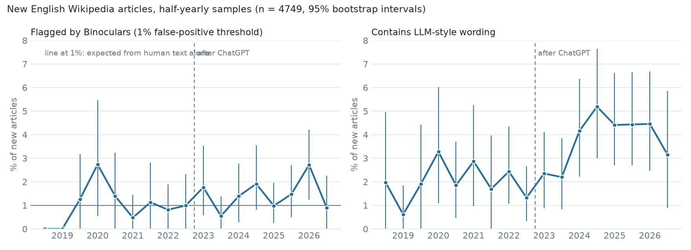

# LLM-style text in new English Wikipedia articles, 2018-2026

A sampling study of how much of the text in newly created English Wikipedia articles looks machine-written, and whether that changed after ChatGPT (30 Nov 2022).

## Summary

- Using a zero-shot detector (Binoculars) calibrated to a 1% false-positive rate on pre-ChatGPT articles, **1.6% (95% CI 1.2-2.2) of surviving new articles from 2024 onward are flagged, against 1.0% expected from human text alone.** The score distribution of 2024+ articles is statistically indistinguishable from 2018-2022 (KS test p = 0.14, median score 1.041 vs 1.044).
- A second, independent signal moves more clearly: **articles containing wording that Wikipedia editors list as typical of LLMs rose from 2.0% (1.4-2.7) before ChatGPT to 4.4% (3.5-5.3) from 2024**. The rise starts in 2024H1, not in 2023.
- These results do not reproduce the "over 5% of new articles flagged" reported for August 2024 by Brooks, Eggert and Peskoff (2024). For a 5% share of LLM text to be compatible with our flag rate, the detector would have to catch at most about 24% of real-world LLM text; on raw output from three open models it catches 67-88%. We therefore read our numbers as evidence that the share of detectable LLM text among *surviving* new articles is low (a few percent at most), not as proof that it is near zero.



## Data

- **Sampling.** Wikipedia's page-creation log, 8 random hours per month. Months are sampled every second month for 2018-09 to 2021-12 (the log starts in 2018-09) and every month from 2022-01 to 2026-09, 77 months in all. We keep creations in the main namespace and in Draft, 54,497 events, and fetch the text of each *creation revision* through the API (so later human edits do not hide the original text).
- **Eligible text.** Creation revision still retrievable, not a redirect, at least 150 words of prose after wikitext stripping: 5,604 documents (4,749 main namespace, 855 Draft). Median 299 words.
- **Detector input.** The first 250 words of prose.

## Methods

1. **Detector.** Binoculars (Hans et al., 2024): log-perplexity under an instruction-tuned model divided by the cross-perplexity with its base model. We use the Qwen2.5-1.5B / Qwen2.5-1.5B-Instruct pair so that it fits a single T4. Lower score means more machine-like. Following the reference implementation, the log-perplexity term is computed from the instruction-tuned model's logits.
2. **Threshold.** The 1st percentile of scores of main-namespace articles created from 2018-09 to 2021-12 (n = 1,207), assumed human-written. The false-positive rate measured on held-out articles from 2022-01 to 2022-10 (n = 602) is 1.0%.
3. **True-positive rate.** We prompted three open models (Qwen2.5-3B-Instruct, Phi-3.5-mini-instruct, Qwen3-4B-Instruct-2507) to write 300 article leads each about titles of real pre-2022 articles. At the threshold, 88%, 75% and 67% are flagged. This is an optimistic estimate: unedited output, simple prompts, small models.
4. **Lexical markers.** A fixed list of words and phrases from the English Wikipedia essay [Signs of AI writing](https://en.wikipedia.org/wiki/Wikipedia:Signs_of_AI_writing) (read 2026-10-03), chosen before any data were looked at: for example "tapestry", "testament", "pivotal", "showcasing", "nestled", "stands as", "in the heart of", "plays a pivotal role". An article counts as marked if it contains one listed phrase or at least two listed words. See `ai_text/lexical.py`.
5. **Uncertainty.** Percentile bootstrap, 2,000 resamples, over articles.

## Results

| | 2018-09 to 2022-11 | 2024 onward |
|---|---|---|
| Articles scored (main namespace) | 1,809 | 2,167 |
| Flagged by Binoculars | 1.05% (0.6-1.5) | 1.62% (1.2-2.2) |
| Median Binoculars score | 1.044 | 1.041 |
| Contains LLM-style wording | 2.0% (1.4-2.7) | 4.4% (3.5-5.3) |

The pre-2022-12 figure includes the articles used to set the threshold, so it sits near 1% by construction; the held-out 2022 FPR is 1.0%.

If the flag rate of 1.6% is converted to a prevalence with the usual correction, (flag rate - FPR) / (TPR - FPR), the estimate is 0.7% if the detector catches 90% of LLM text, 0.9% at 70%, 1.3% at 50% and 2.1% at 30%. Reaching a 5% prevalence would need a real-world TPR of 24% or less.

The two signals agree in direction. Among 2024+ articles with LLM-style wording (n = 95), 3.2% are flagged by Binoculars against 1.5% of the others, and their median score is lower (1.027 vs 1.041). The association is weak, which is itself informative: wording markers and the perplexity detector do not pick out the same articles.

Draft pages (855 scored) show flag rates of 0-5% per year with no trend, but 73-85% of sampled drafts from 2018-2025 can no longer be fetched (they were deleted), so no conclusion is drawn for drafts.

## Limitations

- **Survivorship.** Deleted pages cannot be read. Pages removed for being machine-generated (the speedy-deletion criterion G15 covers pages with unambiguous signs such as leftover chatbot phrasing or invented references) are missing from the sample, so prevalence among *all* created pages is higher than measured here. The retrievable share of main-namespace creations rose from about 91% to about 95% in 2024+, which mostly reflects the shorter time those pages have had to be deleted and cannot be read as a trend.
- **Route into the encyclopedia.** Main-namespace creations by established accounts are over-represented. Articles that reach the main namespace by moving an accepted Draft are not logged as main-namespace creations and are not in the main-namespace sample.
- **Detector power in the wild is unknown.** TPR was measured on unedited output of small open models. Text from newer or larger models, edited by a human, or generated with style instructions, can score as human. A 1.5B pair is also likely to be weaker than larger observer/performer pairs, and the earlier study ran GPTZero next to Binoculars. These differences could explain the gap to the 5% figure; we cannot separate them from a real difference in prevalence.
- **No per-article ground truth.** Neither signal is a label. Wording markers can occur in human prose (promotional text from paid editors is a known confound), so the 4.4% is an upper bound on LLM-attributable marking only if no other change in promotional writing occurred.
- **Sample size.** About 180 articles per quarter; quarterly series are too noisy to read, so half-years are plotted.
- **Time lag.** The sample was drawn on 2026-10-03. Recent months have had less time for either deletion or cleanup.

## Reproducing

```sh
pip install -r requirements.txt
python -m ai_text.collect             # about 4 hours, the API throttles shared IPs
python -m ai_text.prepare
python scripts/detect.py --n-ref 300  # GPU (T4 is enough), about 1.5 hours
python -m ai_text.analyze
python -m ai_text.report
```

`results/` holds `summary.json`, `headline.json`, `quarterly.csv` and `halfyearly.csv`.

## References

- Brooks, C., Eggert, S., Peskoff, D. (2024). The Rise of AI-Generated Content in Wikipedia. Proceedings of the First Workshop on Advancing NLP for Wikipedia. https://aclanthology.org/2024.wikinlp-1.12/
- Hans, A. et al. (2024). Spotting LLMs With Binoculars: Zero-Shot Detection of Machine-Generated Text. ICML 2024. https://arxiv.org/abs/2401.12070
